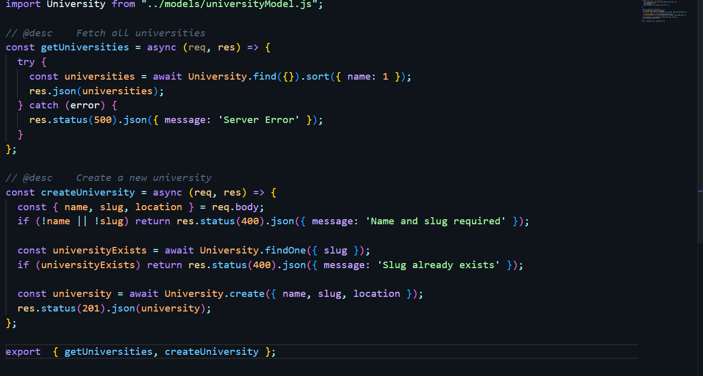
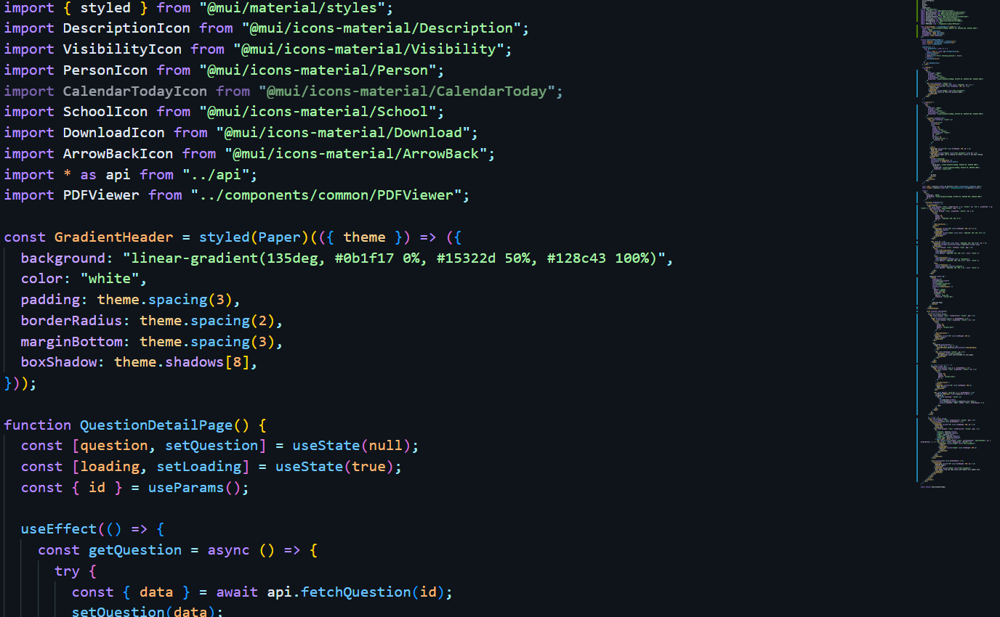
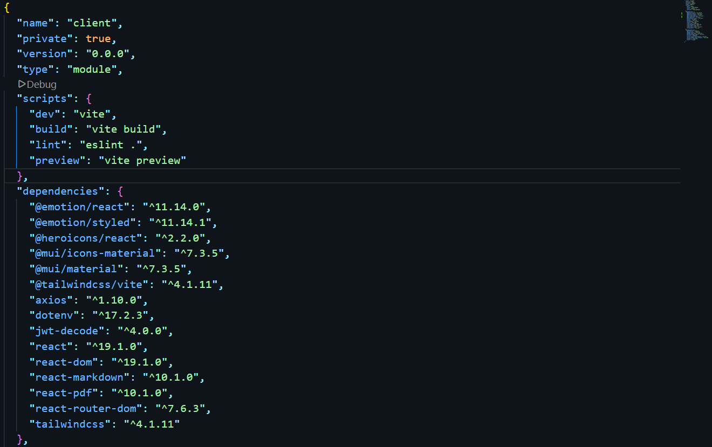

# 🌙 Midnight Code

**Midnight Code** is a clean, modern dark theme for Visual Studio Code, designed for long coding sessions with high readability, calm contrast, and Firebase-inspired syntax highlighting.

Built for developers who love a deep blue night aesthetic without eye strain.

---

## ✨ Features

- 🌌 Deep midnight blue background for focused coding
- 🎯 Firebase-style syntax highlighting (clean & readable)
- 🔍 High contrast without harsh colors
- ⚡ Optimized for JavaScript, TypeScript, React, JSON, HTML, CSS, and Markdown
- 🧠 Carefully balanced colors for long coding sessions

---

## 🎨 Color Palette

| Element     | Color               |
| ----------- | ------------------- |
| Background  | `#0F141A`           |
| Foreground  | `#DDE6F0`           |
| Accent Blue | `#2289FE`           |
| Keywords    | Soft Purple         |
| Strings     | Calm Green          |
| Functions   | Cyan Blue           |
| Numbers     | Warm Orange         |
| Comments    | Muted Gray (italic) |

---

## 🖥️ Screenshots

### JavaScript

### React / JSX

### JSON

---

## 🚀 How to Use

1. Open **VS Code**
2. Press `Ctrl + Shift + P`
3. Select **Color Theme**
4. Choose **Midnight Code**

---

## 📦 Installation

Search for **Midnight Code** in the VS Code Marketplace and click **Install**.

---

## 📄 License

MIT License

---

⭐ If you enjoy **Midnight Code**, consider leaving a review on the Marketplace.

**Enjoy coding at midnight 🌙**
